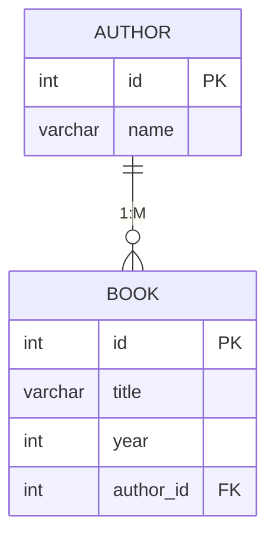
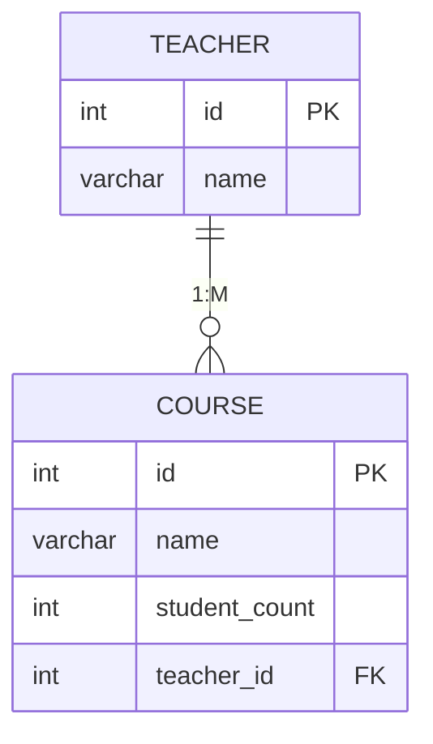
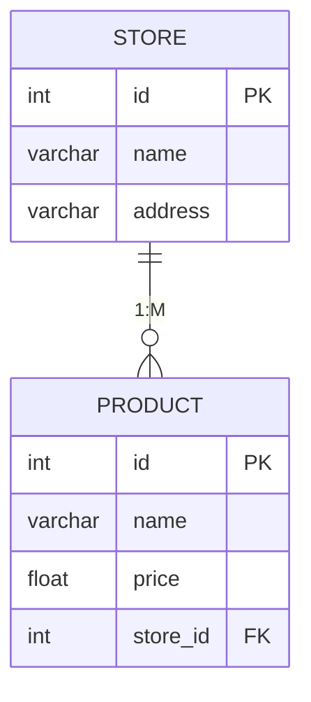
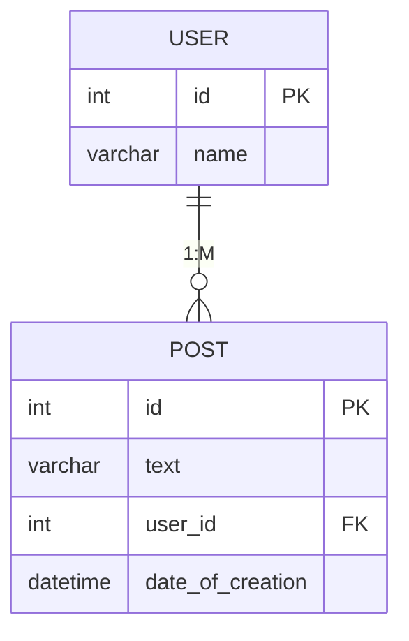
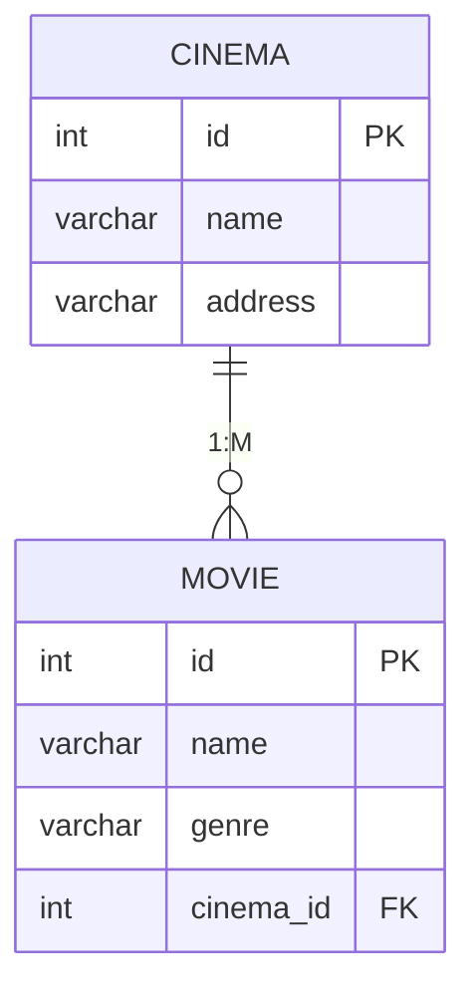
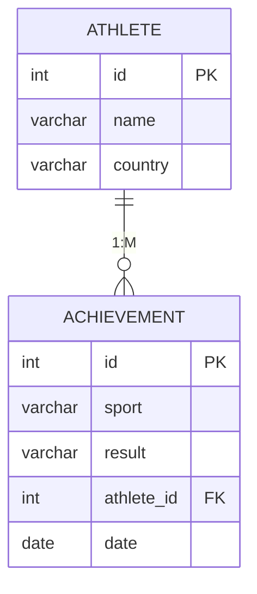

# Общие требования

Общие требования для всех вариантов
- Все ошибки должны возвращаться с корректными HTTP-статусами (400, 404, 422 и др.) и информативным описанием причины ошибки.
- Валидация входных данных должна осуществляться средствами Pydantic и FastAPI.
- При попытке обращения к несуществующим сущностям (например, по несуществующему id) должен возвращаться статус 404.
- При ошибках валидации данных (например, неверный формат, отсутствие обязательных полей, логические ограничения) должен возвращаться статус 400 или 422 с пояснением.
- Для всех операций удаления связанных сущностей реализовать каскадное удаление (ON DELETE CASCADE), если это указано в варианте.
- Все эндпоинты должны работать строго по описанному API-контракту.
- Все ответы и ошибки должны быть оформлены в формате JSON.
- **FastAPI-приложение должно быть оформлено так, чтобы объект приложения назывался app и был доступен на верхнем уровне модуля (в файле ```main.py``` или ```app.py``` должна быть строка ```app = FastAPI()``` без вложенности в функции или классы, чтоб работало ```from main/app import app``` и этот ```app: FastAPI```).**
- Не допускается создание приложения внутри функций или условных операторов.
- Вся логика и маршруты должны регистрироваться на объекте app непосредственно после его создания.
- Не должно быть дополнительных экземпляров FastAPI, кроме основного app.

## Пример корретного оформления:

файл ```4lab/main.py```
```python
from fastapi import FastAPI

app = FastAPI()

@app.get("/ping")
def ping():
    return {"status": "ok"}
```

# Критерии оценивания

Если программа не запускается или заимствований более 70%, то работа не принимается.

## 1. Базовые требования (60 баллов)
- За каждый непройденный тест: -5 баллов  
- Если тесты не запускаются (критические ошибки или проблемы импорта):  
  - За каждую найденную ошибку в работе эндпоинтов: -10 баллов  
  - За синтаксические/логические ошибки, препятствующие запуску: -20 баллов

## 2. Дополнительные задания (если по 1 пункту менее 60 баллов)
- Добавление пагинации для GET-эндпоинтов: +5 баллов  
- Любое другое расширение функционала (по согласованию): до +10 баллов
- Соблюдение PEP8 и стиля кодирования: +5 баллов 
- Корректное использование FastAPI/SQLAlchemy/Pydantic: до +5 баллов 


# Варианты


## 1. API для библиотеки

### ER-диаграмма БД




### API-контракт

#### Авторы

| Метод | URL | Параметры | Тело запроса | Ответ | Статусы |
| :-- | :-- | :-- | :-- | :-- | :-- |
| GET | `/authors` | - | - | `[{id, имя}, ...]` | 200 |
| POST | `/authors` | - | `{"name": "Лев Толстой"}` | `{id, имя}` | 201, 400 |
| GET | `/authors/{id}` | `id: int` | - | `{id, имя}` | 200, 404 |
| PUT | `/authors/{id}` | `id: int` | `{"name": "Александр Пушкин"}` | `{id, имя}` | 200, 404 |
| DELETE | `/authors/{id}` | `id: int` | - | - | 204, 404 |

#### Книги

| Метод | URL | Параметры | Тело запроса | Ответ | Статусы |
| :-- | :-- | :-- | :-- | :-- | :-- |
| GET | `/books` | `author_id: int` (опц.) | - | `[{id, название, год, author_id}, ...]` | 200 |
| POST | `/books` | - | `{"title": "Война и мир", "year": 1869, "author_id": 1}` | `{id, название, год, author_id}` | 201, 400, 404 |


### Дополнительные требования к реализации

- Добавить валидацию для:
  - Года издания книги (не будущее время)


## 2. API для управления курсами и преподавателями университета

### ER-диаграмма БД




### API-контракт

#### Преподаватели

| Метод | URL | Параметры | Тело запроса | Ответ | Статусы |
| :-- | :-- | :-- | :-- | :-- | :-- |
| GET | `/teachers` | - | - | `[{id, имя}, ...]` | 200 |
| POST | `/teachers` | - | `{"name": "Иванов И.И."}` | `{id, имя}` | 201, 400 |
| GET | `/teachers/{id}/courses` | `id: int` | - | `[{id, название, кол-во студентов, teacher_id}, ...]` | 200, 404 |
| DELETE | `/teachers/{id}` | `id: int` | - | - | 204, 404 |

#### Курсы

| Метод | URL | Параметры | Тело запроса | Ответ | Статусы |
| :-- | :-- | :-- | :-- | :-- | :-- |
| GET | `/courses` | - | - | `[{id, название, кол-во студентов, teacher_id}, ...]` | 200 |
| POST | `/courses` | - | `{"name": "Математический анализ", "student_count": 25, "teacher_id": 1}` | `{id, название, кол-во студентов, teacher_id}` | 201, 400, 404 |
| DELETE | `/courses/{id}` | `id: int` | - | - | 204, 404 |


### Дополнительные требования к реализации


- При удалении преподавателя должны удаляться все его курсы (ON DELETE CASCADE).


## 3. API для магазина и товаров

### ER-диаграмма БД




### API-контракт

#### Магазины

| Метод | URL | Параметры | Тело запроса | Ответ | Статусы |
| :-- | :-- | :-- | :-- | :-- | :-- |
| GET | `/stores` | - | - | `[{id, название, адрес}, ...]` | 200 |
| POST | `/stores` | - | `{"name": "Магнит", "address": "ул. Ленина, 1"}` | `{id, название, адрес}` | 201, 400 |
| GET | `/stores/{id}/products` | `id: int` | - | `[{id, название, цена, store_id}, ...]` | 200, 404 |
| PUT | `/stores/{id}` | `id: int` | `{"name": "Пятёрочка", "address": "ул. Мира, 2"}` | `{id, название, адрес}` | 200, 404 |

#### Товары

| Метод | URL | Параметры | Тело запроса | Ответ | Статусы |
| :-- | :-- | :-- | :-- | :-- | :-- |
| GET | `/products` | `store_id: int` (опц.) | - | `[{id, название, цена, store_id}, ...]` | 200 |
| POST | `/products` | - | `{"name": "Хлеб", "price": 40.5, "store_id": 1}` | `{id, название, цена, store_id}` | 201, 400, 404 |
| DELETE | `/products/{id}` | `id: int` | - | - | 204, 404 |


### Дополнительные требования к реализации

- Комбинация полей для магазина (name, address) должны быть уникальны (UNIQUE (name, address)). То есть не может быть двух одинаковых магазинов по одному адресу.


## 4. API для блога (пользователи и посты)

### ER-диаграмма БД




### API-контракт

#### Пользователи

| Метод | URL | Параметры | Тело запроса | Ответ | Статусы |
| :-- | :-- | :-- | :-- | :-- | :-- |
| GET | `/users` | - | - | `[{id, никнейм}, ...]` | 200 |
| POST | `/users` | - | `{"name": "vasya"}` | `{id, никнейм}` | 201, 400 |
| GET | `/users/{id}/posts` | `id: int` | - | `[{id, текст, дата_создания, user_id}, ...]` | 200, 404 |
| DELETE | `/users/{id}` | `id: int` | - | - | 204, 404 |

#### Посты

| Метод | URL | Параметры | Тело запроса | Ответ | Статусы |
| :-- | :-- | :-- | :-- | :-- | :-- |
| GET | `/posts` | `user_id: int` (опц.) | - | `[{id, текст, дата_создания, user_id}, ...]` | 200 |
| POST | `/posts` | - | `{"text": "Привет, мир!", "user_id": 1}` | `{id, текст, дата_создания, user_id}` | 201, 400, 404 |
| PUT | `/posts/{id}` | `id: int` | `{"text": "Обновлённый текст"}` | `{id, текст, дата_создания, user_id}` | 200, 404 |


### Дополнительные требования к реализации


- Дата создания поста выставляется автоматически при создании.


## 5. API для кинотеатров и фильмов

### ER-диаграмма БД




### API-контракт

#### Кинотеатры

| Метод | URL | Параметры | Тело запроса | Ответ | Статусы |
| :-- | :-- | :-- | :-- | :-- | :-- |
| GET | `/cinemas` | - | - | `[{id, название, адрес}, ...]` | 200 |
| POST | `/cinemas` | - | `{"name": "Киномир", "address": "ул. Гагарина, 10"}` | `{id, название, адрес}` | 201, 400 |
| GET | `/cinemas/{id}/movies` | `id: int` | - | `[{id, название, жанр, cinema_id}, ...]` | 200, 404 |
| DELETE | `/cinemas/{id}` | `id: int` | - | - | 204, 404 |

#### Фильмы

| Метод | URL | Параметры | Тело запроса | Ответ | Статусы |
| :-- | :-- | :-- | :-- | :-- | :-- |
| GET | `/movies` | `cinema_id: int` (опц.) | - | `[{id, название, жанр, cinema_id}, ...]` | 200 |
| POST | `/movies` | - | `{"name": "Интерстеллар", "genre": "фантастика", "cinema_id": 1}` | `{id, название, жанр, cinema_id}` | 201, 400, 404 |
| PUT | `/movies/{id}` | `id: int` | `{"name": "Обновлённое название", "genre": "драма"}` | `{id, название, жанр, cinema_id}` | 200, 404 |

### Дополнительные требования к реализации

- Для GET /movies предусмотреть фильтрацию по cinema_id через query-параметр.


## 6. API для спортсменов и их достижений

### ER-диаграмма БД




### API-контракт

#### Спортсмены

| Метод | URL | Параметры | Тело запроса | Ответ | Статусы |
| :-- | :-- | :-- | :-- | :-- | :-- |
| GET | `/athletes` | - | - | `[{id, имя, страна}, ...]` | 200 |
| POST | `/athletes` | - | `{"name": "Иван Иванов", "country": "Россия"}` | `{id, имя, страна}` | 201, 400 |
| GET | `/athletes/{id}/achievements` | `id: int` | - | `[{id, вид_спорта, результат, дата, athlete_id}, ...]` | 200, 404 |
| DELETE | `/athletes/{id}` | `id: int` | - | - | 204, 404 |

#### Достижения

| Метод | URL | Параметры | Тело запроса | Ответ | Статусы |
| :-- | :-- | :-- | :-- | :-- | :-- |
| GET | `/achievements` | `athlete_id: int` (опц.) | - | `[{id, вид_спорта, результат, дата, athlete_id}, ...]` | 200 |
| POST | `/achievements` | - | `{"sport": "Плавание", "result": "1-е место на Олимпиаде", "date": "2024-07-28", "athlete_id": 1}` | `{id, вид_спорта, результат, дата, athlete_id}` | 201, 400, 404 |
| DELETE | `/achievements/{id}` | `id: int` | - | - | 204, 404 |

### Дополнительные требования к реализации

- Для GET /achievements предусмотреть фильтрацию по athlete_id через query-параметр.
